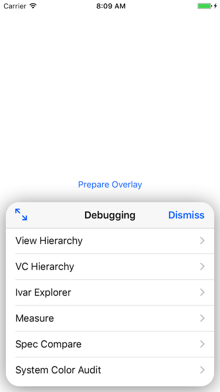

# DebugOverlay
A debugging information overlay for your iOS app

---
## Warning
This library uses private Apple APIs and should _**NOT**_ be used in a production environment.  It is the responsibility of the implementing developer to ensure the overlay is not used in production.

---
### Usage
To use the debug overlay, call the `prepareForPresentation()` method then two-finger tap on the status bar inside of your application.  A modal should appear with a list of debug options.

For simulator usage, you can use the `toggleVisibility()` method to make the overlay appear.

To use the spec compare feature, you must add the `NSPhotoLibraryUsageDescription`
key and a value to your info.plist.

